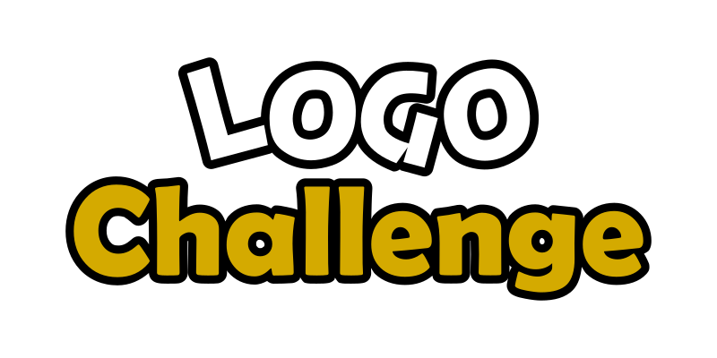

    
  	 
		<a href="#brief">Brief</a>  |   
		<a href="#themes">Themes</a>   |  
		<a href="#how-to-participate">How to participate</a>   |  
	

 

## Brief
Looking for inspiration, sharpening your skills or just having fun ? we've prepared this challenge just for that with a predefined list of themes to go with.

## Themes

You should pick one or multiple themes from the following list:
 * Tea company:  
    You have been hired by a tea company to design their brand's logo to help them market their products. (you can pick any name for the company or leave it nameless if you want to make just an iconic logo)

 * Personal logo:  
    It is self explanatory and the least restrictive theme, if you already have a personal logo try to remake one :)
    
 * Clothing store:  
    You were requested a logo for a clothing store, the Store provides all kind of clothing and the owner want a catchy logo to attract customers.

 * Redesign **OpenMindsClub**'s Logo:  
	Try to remake [OMC](omc-logo.png) logo in your own style, it should always be based on open source philosophy and our slogan "Ce qui ne se partage pas se perd" ("What is not shared is lost").

 * Redesign a programming language logo:  
    It is self explanatory, but here is a list of suggestions: `Python`, `Java`, `Ruby`... you may also design a logo for [GDScript](https://docs.godotengine.org/en/stable/getting_started/scripting/gdscript/index.html), a scripting language for the [Godot Engine](https://godotengine.org) which doesn't have an official logo yet.

## How to participate

Pick your desired theme(s) for the logo(s) you will be making while considering these rules:
* External assets should not be copyrighted and you must be allowed to use them.
* The design has to be done during the timeline of the event.
* You can use any tool to design the logo.
* Final result should be in of these formats: `png`, `jpg`, `jpeg` or `svg`.
* the file name should be `your_username-theme` and placed in [entries](entries) directory.