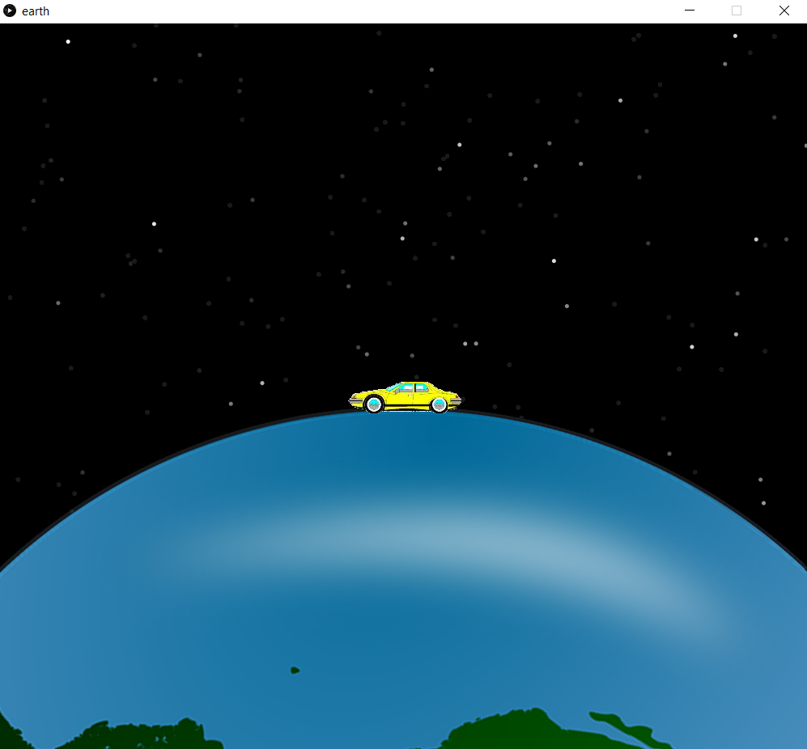

# Earth Animation


This simple programe written with processing (like JAVA but easier).<br>
It's a progme that animate the earth with a car.
Click <a href="https://processing.org"> here </a> to read more about processing3.

## Features :dart:
* [x] Free & Open Source
* [x] Very Easy to use
* [x] No Internet connection required

## Screenshots
Earth Animation   
:---------------------: 


## Requirements
* processing3

## How To Use It
1. Download Processing3 from this link: https://processing.org/download/
2. Install this repository.
3. Extract the folder.
4. Open the ```earth.pde``` file.
5. Run it :)

## Contributing 💡
If you want to contribute to this project and make it better with new ideas, your pull request is very welcomed.<br>
If you find any issue just put it in the repository issue section, thank!<br><br>
.سبحَانَكَ اللَّهُمَّ وَبِحَمْدِكَ، أَشْهَدُ أَنْ لا إِلهَ إِلأَ انْتَ أَسْتَغْفِرُكَ وَأَتْوبُ إِلَيْ
