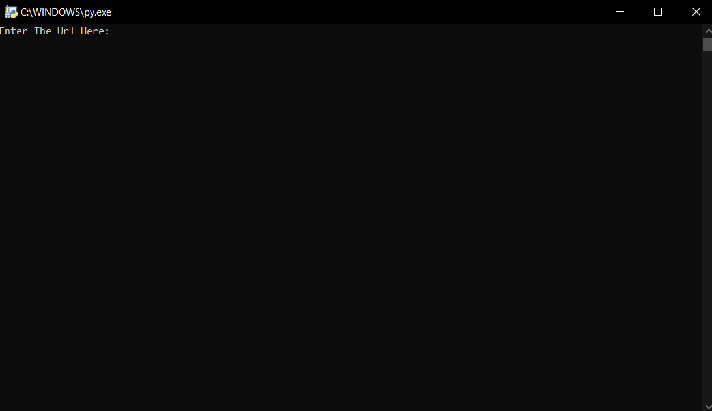
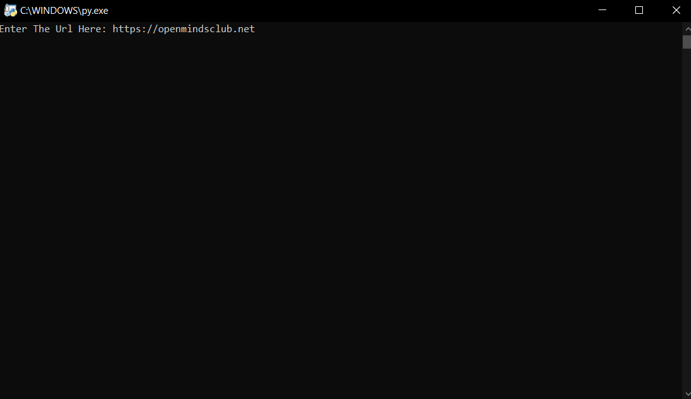
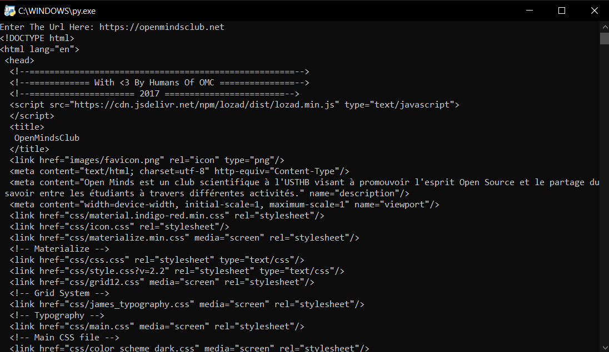
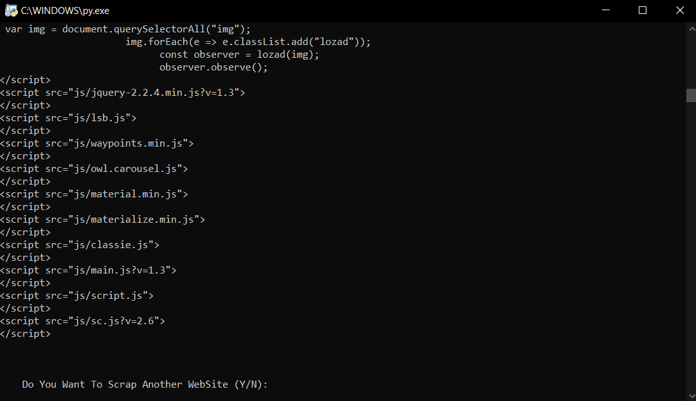

# Get The HTML Code


#100daysofcode This simple programe written in python with beautifulsoup module and the requests library.<br>
This programe allows you to get the html code from any website.<br>
Click <a href="https://www.crummy.com/software/BeautifulSoup/bs4/doc/"> here </a> to read more about beautifulsoup.<br>
Click <a href="https://requests.readthedocs.io/en/master/"> here </a> to read more about requests.

## Features :dart:
* [x] Free & Open Source
* [x] Very Easy to use

## Screenshot
Home   |  Paste The Link
:---------------------: | :-----------------:
 | 
Get The Code   |  Simple Question
 | 

## Requirements
* python
* beautifulsoup
* requests

## How To Use It
1. Download Python from this link: https://www.python.org/downloads/
2. Install the packeges, write in your command (cmd):
```bash
pip install beautifulsoup4
pip install requests
```
3. Install this repository, click <a href="https://github.com/mohamedyanis/covid19-tracker2/archive/master.zip"> here </a> to install it.
4. Extract the folder
5. Run the ```gethtml.py``` file

## Contributing 💡
If you want to contribute to this project and make it better with new ideas, your pull request is very welcomed.<br>
If you find any issue just put it in the repository issue section, thank!<br><br>
.سبحَانَكَ اللَّهُمَّ وَبِحَمْدِكَ، أَشْهَدُ أَنْ لا إِلهَ إِلأَ انْتَ أَسْتَغْفِرُكَ وَأَتْوبُ إِلَيْ
