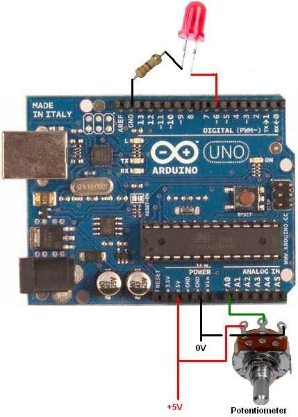
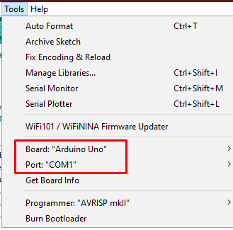

# Arduino PWM LED DIMMER

a simple project that shows how to Dim a LED with PWM using the Arduino UNO micro-controller

## Requirements

These are the softwares/hardwares you will need:

1. Arduino Uno
2. Arduino IDE 
3. Arduino USB cable
4. One LED 
5. One 330 Ohm resistors
6. One Potentiometer
7. Jumper cables
8. A Breadboard

## Setup

1. Board installation:  
	

2. After connecting everything it is time to connect the arduino to the PC and open the Arduino IDE.  

3. Select the serial port that the arduino is connected to and make sure the Arduino Uno is selected as the board.  
	

4. Upload the code and you're done!

        Turn the potentiometer to control the brightness of the LED