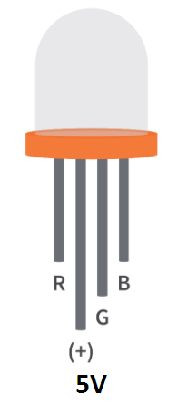
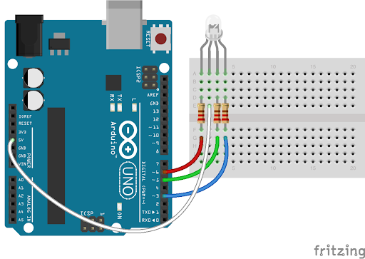
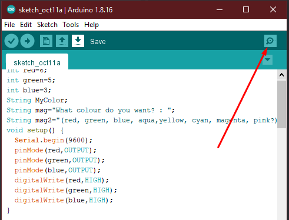
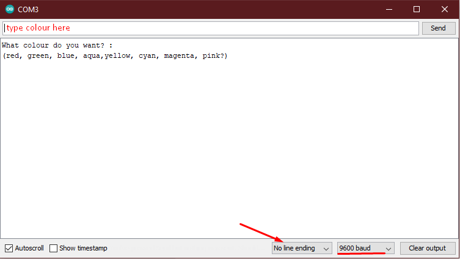

# Arduino controlled RGB LED

a simple project that shows how to control a RGB LED using the Arduino UNO micro-controller

## Requirements

These are the softwares/hardwares you will need:

1. Arduino Uno
2. Arduino IDE
3. Arduino USB cable
4. RGB LED (5V)
5. 3x 330 Ohm resistors
6. Jumper cables
7. Breadboard

	*RGB LED:*  
	

## Setup

1. Board installation:  
	

2. After connecting everything it is time to connect the arduino to the PC and open the Arduino IDE.  

3. Select the serial port that the arduino is connected to and make sure the Arduino Uno is selected as the board.  
	

4. Upload the code then open the serial monitor through here:  
	  

make sure the serial monitors is set to `No line ending` and the same `number baud` set in the code. 
	