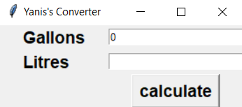
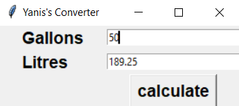

# Gallons To Litres Conventer
[](LICENSE)


This is a simple desktop app written in Python With Tkinter module.<br>
Click <a href="https://docs.python.org/3/library/tk.html"> here</a> to read more about **tkinter** module.<br>

## Features :dart:
* [x] Free & Open Source
* [x] Very Easy to use
* [x] No Internet connection required

## Screenshots
Home           | Painting
:---------------------:|:------------------:
 | 

## Requirements
* python
* tkinter module
 
## How To Use It
1. Download Python from this link: https://www.python.org/downloads/
2. Install the packeges, write in your command (cmd):
```bash
pip install tkinter
```
3. Install this repository, click <a href="https://github.com/mohamedyanis/paint-app/archive/master.zip"> here </a> to install it.
4. Extract the folder.
5. Run the ```paint_app.py``` file.

## :information_source: Important!
This app is for beginners, you can change the mathematical process, use it as a conventer for everything. Just change the The relation between the two units you want to convert. <br>
Change the relation in the line 7: <br>
```python
var3 = var2 * 3.785
```

## Contributing 💡
If you want to contribute to this project and make it better with new ideas, your pull request is very welcomed.<br>
If you find any issue just put it in the repository issue section, thanks!<br><br>
.سبحَانَكَ اللَّهُمَّ وَبِحَمْدِكَ، أَشْهَدُ أَنْ لا إِلهَ إِلأَ انْتَ أَسْتَغْفِرُكَ وَأَتْوبُ إِلَيْكَ

